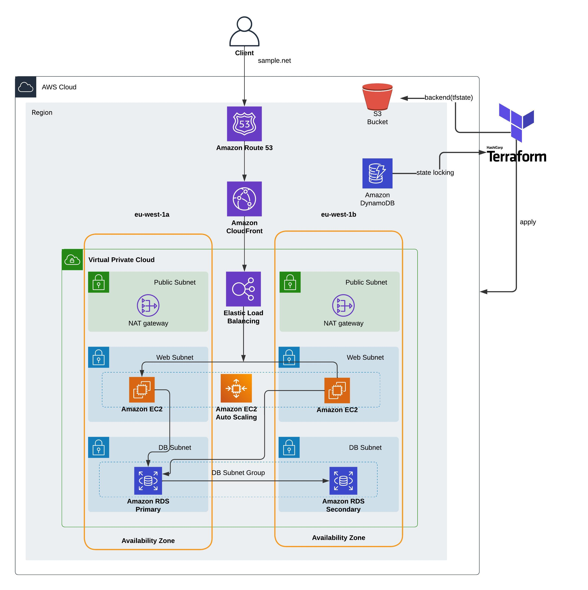

## What is the propose?
Implementing 2-Tier architecture in AWS with Terraform.

## Overview
This project demonstrates a high-availability, and fault-tolerant 2-tier architecture deployed on AWS using Infrastructure as Code (IaC) with Terraform. The architecture is built with the following components:

* Amazon Route 53: Manages DNS routing for our domain (sample.net), directing traffic to CloudFront for optimized content delivery.
* Amazon CloudFront: Provides a content delivery network (CDN) to cache content at edge locations for faster access to users across the globe.
* Elastic Load Balancer (ELB): Distributes incoming traffic across multiple EC2 instances in different availability zones (AZs) within a region for load balancing and fault tolerance.
* Auto Scaling Group (ASG): Automatically adjusts the number of EC2 instances based on traffic demand to maintain performance and manage costs.
* Amazon RDS: A Multi-AZ database setup for high availability. The database is replicated in a secondary AZ for redundancy.
* Amazon S3: Stores Terraform state files for centralized state management.
* Amazon DynamoDB: Provides state locking for Terraform to prevent concurrent state modifications.
* NAT Gateway: Enables secure internet access for instances in private subnets, allowing them to download updates or communicate externally without exposing them directly to the internet.

## Architecture Diagram



## Components
1. Route 53: Routes user requests to CloudFront for efficient content delivery.
2. CloudFront: Acts as a global CDN for faster data delivery and latency reduction.
3. Elastic Load Balancer (ELB): Balances traffic among multiple EC2 instances in different AZs.
4. Auto Scaling Group (ASG): Ensures scalability by adjusting the number of EC2 instances in response to load.
5. Amazon RDS: Multi-AZ deployment with a primary and a standby instance for database redundancy.
6. VPC (Virtual Private Cloud):

   Public Subnets: Hosts NAT Gateways for secure internet access to private resources.
   
    Private Subnets: Hosts the web tier (EC2 instances) and database tier (RDS) within isolated subnets for security.
   
8. Terraform Backend:

   S3 Bucket: Stores the Terraform state files for the infrastructure.

   DynamoDB Table: Manages state locking to prevent conflicts during simultaneous deployments.

## Infrastructure Deployment

### Prerequisites
1. Terraform: Install Terraform on your local machine (instructions).

2. AWS CLI: Configure AWS CLI with access to your AWS account (instructions).

3. AWS IAM Permissions: Ensure your AWS user has the necessary permissions for VPC, EC2, RDS, S3, DynamoDB, and other required services.

### Terraform Setup
1.Initialize Terraform Backend:

* This setup uses an S3 bucket and DynamoDB table for state storage and locking.

* Update the backend configuration in main.tf with your S3 bucket and DynamoDB table details.

2.Configure Variables:

* Define required variables in terraform.tfvars, such as vpc_cidr, subnet_cidrs, db_instance_class, etc.

```
project_name            = ""
region                  = ""
vpc_cidr                = ""
public_subnet_1a_cidr   = ""
public_subnet_2b_cidr   = ""
private_subnet_3a_cidr  = ""
private_subnet_4b_cidr  = ""
private_subnet_5a_cidr  = ""
private_subnet_6b_cidr  = ""
aws_access_key          = ""
aws_secret_key          = ""
db_username             = ""
db_password             = ""
certificate_domain_name = ""
additional_domain_name  = ""
```
3. Deploy Structure
```
terraform init        # Initialize the Terraform configuration
terraform plan        # Review the changes to be made
terraform apply       # Deploy the resources
```

## Directory Structure
```
terraform-2-tier-architecture/
│
├── root
   ├── main.tf                  # Main configuration with multi-region providers and module calls
   ├── variables.tf             # Global variables
   ├── outputs.tf               # Global outputs
   ├── terraform.tfvars         # Variable values
   ├── backend.tf               # Store tfstate and locking purpose
│
├── modules/                 # Directory for modules
│   ├── alb/                 # LoadBalancer module
│   ├── asg/                 # Auto Scaling Group module
│   ├── cloudfront/          # CloudFront module
│   ├── nat/                 # Nat module
│   ├── rds/                 # RDS module
│   ├── route53/             # DNS module
│   ├── sg/                  # Security Group module
│   ├── ssh-key/             # Key module
│   ├── vpc/                 # VPC module
│
└── README.md                # Project documentation
```
## Key Features
1. High Availability: Resources are spread across multiple AZs to ensure high availability.
2. Fault Tolerance: Multi-AZ setup with redundancy in RDS and Auto Scaling ensures failover capability.
3. Scalability: Auto Scaling dynamically adjusts the number of EC2 instances to handle traffic fluctuations.
4. Security: Resources are deployed in a VPC with subnets (public and private) for isolation. Security groups manage access control.
5. Global Reach: CloudFront improves global access to content and reduces latency.

## Modules
* VPC: Defines the VPC, public subnets, private subnets, and associated networking resources.
* ALB: Provisions the Elastic Load Balancer to distribute incoming traffic.
* ASG: Configures the Auto Scaling Group to manage EC2 instances.
* RDS: Deploys the primary and standby RDS instances for database availability.
* CloudFront: Configures CloudFront to cache content at edge locations for low-latency delivery.
* Security Groups: Defines security group rules for the ELB, EC2 instances, and RDS.
* NAT:  Sets up NAT Gateways in each availability zone to provide internet access for private subnets.
* Route 53: Manages DNS records for the domain and routes traffic to CloudFront for efficient content distribution.


