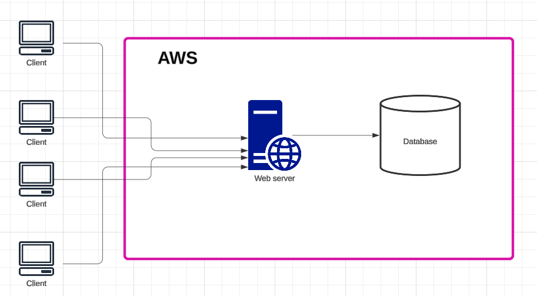

# What is the propose?
Implementing 2-Tier architecture in AWS with Terraform.

## 2-Tier architecture
A two-tier architecture is a client-server model that consists of two layers:

    1. Presentation (Client) Tier: This is the user interface or front-end, where users interact with the application. It could be a web browser or a desktop application.

    2. Data (Server) Tier: The back-end database server, which processes requests from the client, retrieves, stores, and manages data.

